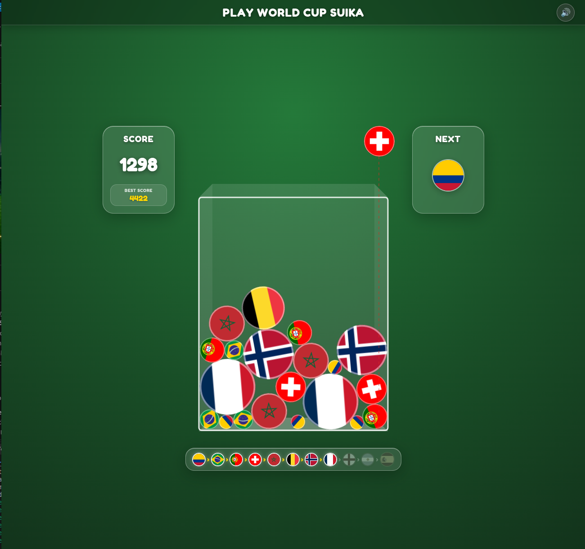
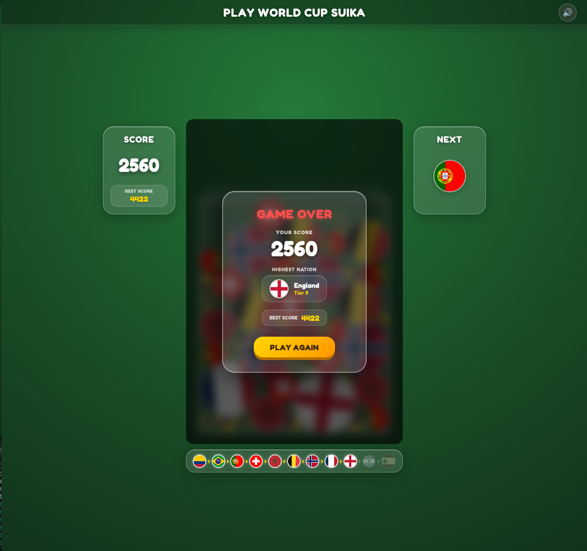

# ⚽ World Cup Suika

[](https://phaser.io/)
[](https://www.typescriptlang.org/)
[](https://brm.io/matter-js/)
[](https://bun.sh/)
[](https://vitejs.dev/)

A vibrant 2D physics puzzle merge game built on the classic *Suika Game* (Watermelon Game) mechanics, themed around the **2026 FIFA World Cup tournament**.

Drop national team flag balls into a 3D frosted glass container, merge identical countries to evolve them up the tournament ladder, and aim for the ultimate champions — **Spain (Tier 11)**!

---

## 📸 Screenshots

| 🎮 Gameplay & Evolution Track | 🏆 Game Over & Record Celebration |
| :---: | :---: |
|  |  |

---

## ✨ Features

- 🏟️ **Stadium Turf & Frosted Glass Interface**: Glassmorphism cards with stadium pitch background, responsive layout, and desktop & mobile touch scaling (`Phaser.Scale.FIT`).
- ⚡ **Matter.js Rigid Body Physics**: Smooth circular collisions, rotational inertia, restitution bounce, and realistic ball settling.
- 🎵 **Procedural Web Audio Synthesizer**: Zero external audio files required! Built purely on the browser's `AudioContext`:
  - Pitch-ascending musical chimes per tier (C4 through G5).
  - Physical drop whoosh and bounce clack sounds.
  - Champion victory fanfare & game-over chimes.
  - Top-bar sound mute toggle with `localStorage` persistence.
- 🚨 **Dynamic Danger Zone**:
  - Soft warning glow as balls approach the container opening ($Y \approx 190$).
  - Pulsating sine-wave panic alert with a 2.5s grace period timer.
- 🏅 **Game Over & Tournament Milestones**:
  - **Highest Nation Reached**: Displays your peak tournament country milestone with circular flag badge and tier number.
  - **New Record Celebration**: Animated pulsating golden record banner (`✨ NEW RECORD! ✨`).
- 🌟 **Dynamic Evolution Track**: Real-time tournament progression bar at the bottom showing unlocked nations with elastic pop animations and glowing golden arrows.
- 🇪🇸 **Grand Champion Finale**: Spawning Spain triggers a multi-colored confetti fountain, screen rumble, and golden celebration banner!

---

## 🏆 Tournament Evolution Ladder

Merge two identical country balls to advance to the next tournament tier:

| Tier | Country | Code | Radius | Points | Role / World Cup 2026 Finish |
| :---: | :--- | :---: | :---: | :---: | :--- |
| **1** | 🇨🇴 Colombia | `co` | 16px | 1 | Group Stage Challenger |
| **2** | 🇧🇷 Brazil | `br` | 22px | 2 | Group Stage Contender |
| **3** | 🇵🇹 Portugal | `pt` | 28px | 4 | Round of 32 Finisher |
| **4** | 🇨🇭 Switzerland | `ch` | 34px | 8 | Round of 32 Finisher |
| **5** | 🇲🇦 Morocco | `ma` | 40px | 16 | Round of 16 Contender |
| **6** | 🇧🇪 Belgium | `be` | 48px | 32 | Round of 16 Contender |
| **7** | 🇳🇴 Norway | `no` | 56px | 64 | Quarter-finalist |
| **8** | 🇫🇷 France | `fr` | 62px | 128 | Semi-finalist (4th Place) |
| **9** | 🏴󠁧󠁢󠁥󠁮󠁧󠁿 England | `gb-eng` | 70px | 256 | Bronze Medalist (3rd Place) |
| **10** | 🇦🇷 Argentina | `ar` | 78px | 512 | Tournament Runner-Up (2nd Place) |
| **11** | 🇪🇸 **Spain** | `es` | 86px | 1024 | 🏆 **World Cup 2026 Champions!** |

---

## 🕹️ Controls

- **Desktop**:
  - **Mouse Move**: Move the drop guide line horizontally.
  - **Click / Mouse Up**: Drop the current country ball into the container.
- **Mobile / Touch**:
  - **Drag / Slide**: Drag finger across the top to align your drop.
  - **Release**: Drop the ball into play.

### ⌨️ Developer Debug Shortcuts
- <kbd>D</kbd> — Trigger instant Danger countdown / Game Over modal.
- <kbd>W</kbd> — Toggle Warning line glow.
- <kbd>C</kbd> — Clear Danger state.
- <kbd>S</kbd> — Trigger Spain Championship confetti celebration & camera shake.

---

## 🚀 Getting Started

### Prerequisites
- [Bun](https://bun.sh/) (Recommended) or [Node.js](https://nodejs.org/) v18+

### Installation & Run

1. **Clone the repository**:
   ```bash
   git clone https://github.com/rasyidcode/world-cup-suika.git
   cd world-cup-suika
   ```

2. **Install dependencies**:
   ```bash
   bun install
   ```

3. **Start the development server**:
   ```bash
   bun dev
   ```
   Open `http://localhost:5173` in your browser.

4. **Build for production**:
   ```bash
   bun run build
   ```

5. **Preview production build**:
   ```bash
   bun run preview
   ```

---

## 🏗️ Project Architecture

```
world-cup-suika/
├── index.html                    # Root HTML layout, 3-column glass cards & modal
├── package.json                  # Project dependencies & scripts
├── tsconfig.json                 # TypeScript configuration
├── screenshots/                  # High-res gameplay and UI screenshots
├── public/
│   └── assets/
│       └── flags/               # National flag image assets (11 countries)
└── src/
    ├── main.ts                   # Web entrypoint & game bootstrap
    ├── style.css                 # Glassmorphism design, animations & responsive styles
    └── game/
        ├── config.ts             # World Cup tier definitions, dimensions, danger line
        ├── types.ts              # TypeScript interfaces and enum types
        ├── audio.ts              # Zero-asset Web Audio API procedural sound synthesizer
        ├── main.ts               # Phaser Game configuration (Matter physics, Scale.FIT)
        ├── gameobjects/
        │   └── Ball.ts           # Custom Matter.Physics.Image circular rigid bodies
        └── scenes/
            ├── Preloader.ts      # Circular flag canvas baking, 3D container, drop guides
            └── Game.ts           # Game loop: drop physics, collision fusions, juice & UI
```

---

## 📄 License

This project is open source and available under the [MIT License](LICENSE).

